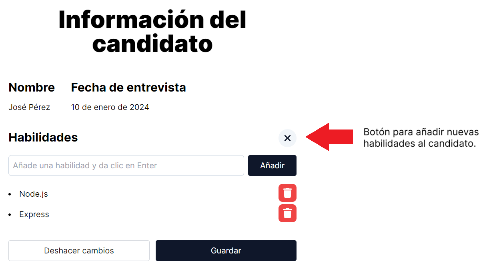

# Aplicación Full Stack con React, Node.js, Express y Firebase Functions

Para el diseño, implementa Tailwind CSS.

## Contenido

- [Funcionalidad (Front End)](#funcionalidad-front-end)
- [Funcionalidad (Back End)](#funcionalidad-back-end)

## Funcionalidad (Front End)

La aplicación muestra una lista de candidatos en la página principal. Cada candidato tiene un card con información básica, incluyendo nombre y fecha de entrevista.

Al hacer clic en el botón "Ver detalles", se abrirá una ventana modal que mostrará la misma información básica (nombre y fecha de entrevista) y las habilidades del candidato.

Puedes agregar o eliminar habilidades. Cuando exista alguna modificación en las habilidades aparecerán los botones para descartar los cambios o guardarlos. Este último guardará los cambios en la base de datos.

## Funcionalidad (Back End)

El Back End está realizado en Node.js con el framework Express y Firebase Firestore Database.

La API proporciona servicios para gestionar la información de los candidatos.

### Endpoints

A continuación, se describen los diferentes endpoints a partir de la URL base.

**URL base:** https://us-central1-practica-web-full-stack.cloudfunctions.net/app/api

### 1. Obtener todos los candidatos

- **URL:** `/candidatos`
- **Método HTTP:** GET
- **Descripción:** Obtiene la lista de todos los candidatos registrados en la base de datos.

### 2. Obtener información de un candidato por su ID

- **URL:** `/candidato/:id`
- **Método HTTP:** GET
- **Descripción:** Obtiene la información detallada de un candidato específico utilizando su ID.

### 3. Crear un nuevo candidato

- **URL:** `/candidatos/crear`
- **Método HTTP:** POST
- **Descripción:** Crea un nuevo candidato. Se requiere proporcionar en el cuerpo (body) de la solicitud los siguientes datos:
  - `nombre: string`: Nombre del candidato.
  - `habilidades: string[]`: Listado de tecnologías.

### 4. Editar un candidato dado por su ID

- **URL:** `/candidato/:id/editar`
- **Método HTTP:** PUT
- **Descripción:** Edita la información de un candidato específico utilizando su ID. Se requiere proporcionar en el cuerpo (body) de la solicitud los siguientes datos:
  - `nombre: string`: Nombre del candidato.
  - `habilidades: string[]`: Listado de tecnologías.
  - `fecha_entrevista: object`: Objeto `timestamp`.
    - `fecha_entrevista._seconds: number`
    - `fecha_entrevista._nanoseconds: number`
